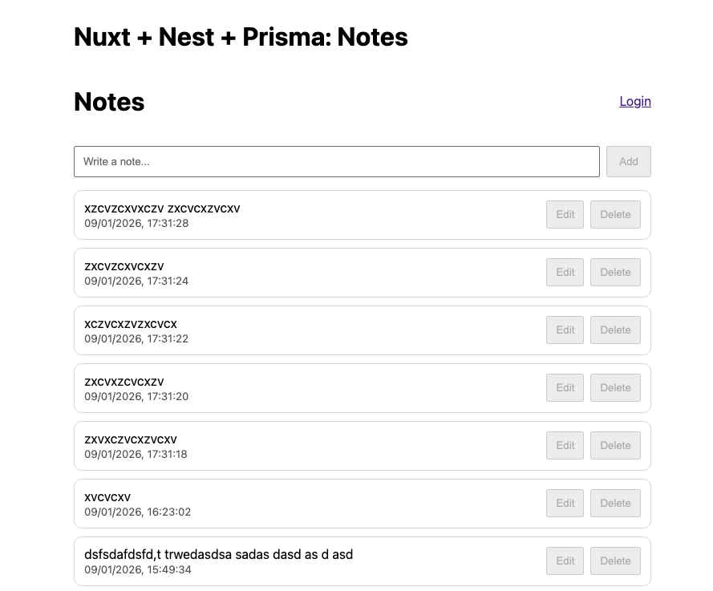

# Full-Stack Notes App (Nuxt + Nest + Prisma + JWT)

A small full-stack notes application built to demonstrate **Nuxt (Vue)** on the frontend and **NestJS** on the backend, with **Prisma + SQLite** for persistence and **JWT authentication** to protect write operations.

## Tech Stack
- **Frontend:** Nuxt (Vue 3)
- **Backend:** NestJS (TypeScript)
- **DB/ORM:** Prisma + SQLite
- **Auth:** JWT (Bearer token)

## Features
- ✅ View notes (public `GET /notes`)
- ✅ Register & login (`/auth/register`, `/auth/login`)
- ✅ Protected CRUD:
  - `POST /notes` (requires JWT)
  - `PATCH /notes/:id` (requires JWT)
  - `DELETE /notes/:id` (requires JWT)
- ✅ DTO validation (NestJS)
- ✅ Prisma migrations
- ✅ Local dev setup with environment variables

## Repo Structure
api/ # NestJS + Prisma + JWT
web/ # Nuxt frontend

## Quick Start (Local)

### 1) Backend (Nest + Prisma)

    cd api
    cp .env.example .env
    npm install
    npx prisma generate
    npx prisma migrate dev
    npm run start:dev
Backend will run on: http://localhost:4000

### 2) Frontend (Nuxt)

    cd ../web
    cp .env.example .env
    npm install
    npm run dev
Frontend will run on: http://localhost:3000 (or 3001 if 3000 is busy)

## Environment Variables
api/.env

    DATABASE_URL (SQLite file URL)

    JWT_SECRET (dev secret)

    PORT (optional; default 4000)

web/.env

    NUXT_PUBLIC_API_BASE (API base URL)

## API Endpoints
Auth

    POST /auth/register
    Body: { "email": "test@example.com", "password": "password123" }

    POST /auth/login
    Body: { "email": "test@example.com", "password": "password123" }
    Returns: { "access_token": "..." }
Notes

    GET /notes (public)
    POST /notes (JWT required)
    PATCH /notes/:id (JWT required)
    DELETE /notes/:id (JWT required)

## Example (curl)
# Register
curl -X POST http://localhost:4000/auth/register \
  -H "Content-Type: application/json" \
  -d '{"email":"test@example.com","password":"password123"}'

# Login
TOKEN=$(curl -s -X POST http://localhost:4000/auth/login \
  -H "Content-Type: application/json" \
  -d '{"email":"test@example.com","password":"password123"}' | node -p "JSON.parse(fs.readFileSync(0,'utf8')).access_token")

# Create note (protected)
curl -X POST http://localhost:4000/notes \
  -H "Content-Type: application/json" \
  -H "Authorization: Bearer $TOKEN" \
  -d '{"text":"Hello from JWT"}'

### Kubernetes (Docker Desktop)
kubectl apply -f k8s/

# Ingress (local)
kubectl -n ingress-nginx port-forward svc/ingress-nginx-controller 8080:80

Web: http://localhost:8080
API: http://localhost:8080/api/notes

#Security

Passwords are hashed (bcrypt)
JWT secret is not committed
.env and DB files ignored

## Screenshot

